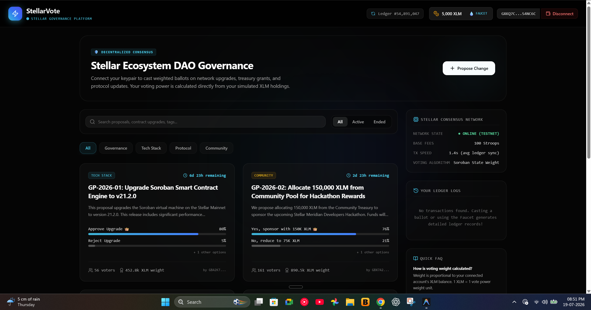

<div align="center">

</div>

# 🗳️ Stellar Community Poll (Web3)

> **A minimal, elegant decentralized voting platform. Built for the rapid development competition using Next.js and Google AI Studio.**

## 🌟 Overview

The Stellar Community Poll is a Web3-enabled application that allows community members to view active proposals and cast their votes securely using the Stellar network.

### 📸 Screenshots
#### Home Screen / Active Polls


### 💎 Key Features
1. **Poll Feed:** View active and closed community polls as beautiful, interactive cards.
2. **Secure Voting:** Users can cast their votes securely using their Stellar wallets.
3. **Live Web3 Integration:** Fully integrated with the Stellar blockchain using `@creit.tech/stellar-wallets-kit` (v2 API).
4. **Modern UI/UX:** Built with a premium Bento-box layout, Glassmorphism, and responsive Light/Dark modes.

## 🛠 Tech Stack
- **Framework:** Next.js (App Router)
- **Styling:** Tailwind CSS (v4)
- **State Management:** Zustand
- **Web3:** Stellar SDK & Stellar Wallets Kit
- **Icons:** Lucide React

## 🚀 Getting Started

First, install dependencies:
```bash
npm install
```

Run the development server:
```bash
npm run dev
```

Open [http://localhost:3000](http://localhost:3000) with your browser to interact with the dApp.

---

Made with Love by bibek Das.
